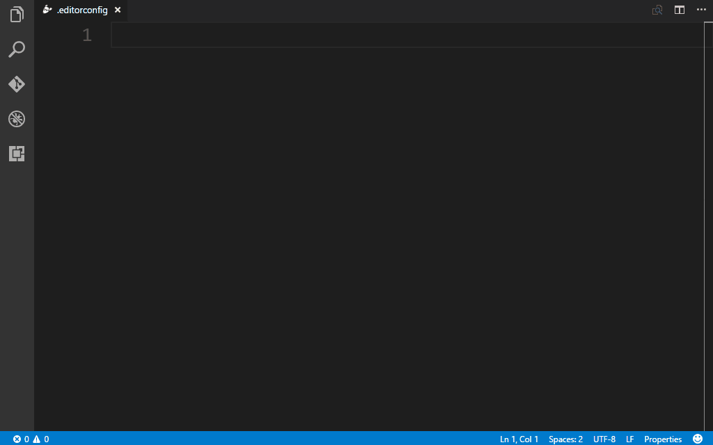

# VSCode Essentials Snippets

> A collection of essentials snippets for Visual Studio Code.

## Installation

1. Install Visual Studio Code
2. Launch Visual Studio Code
3. Choose **Extensions** from menu
4. Search for `vscode-essentials-snippets`
5. Click **Install** to install it
6. Click **Reload** to reload the Code

## Usage

Type part of a snippet, press `enter` and the snippet unfolds.

#### Project snippets

| Snippet | Content |
| ------- | ------- |
| `editorconfig` | EditorConfig file |
| `npmrc` | npm configuration file |

## Author

[Roberto Achar](https://twitter.com/RobertoAchar)

## License

[MIT](https://github.com/robertoachar/vscode-essentials-snippets/blob/master/LICENSE)
